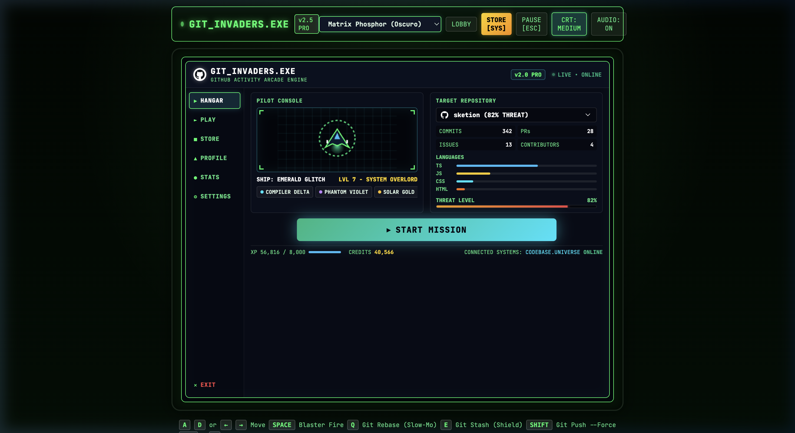
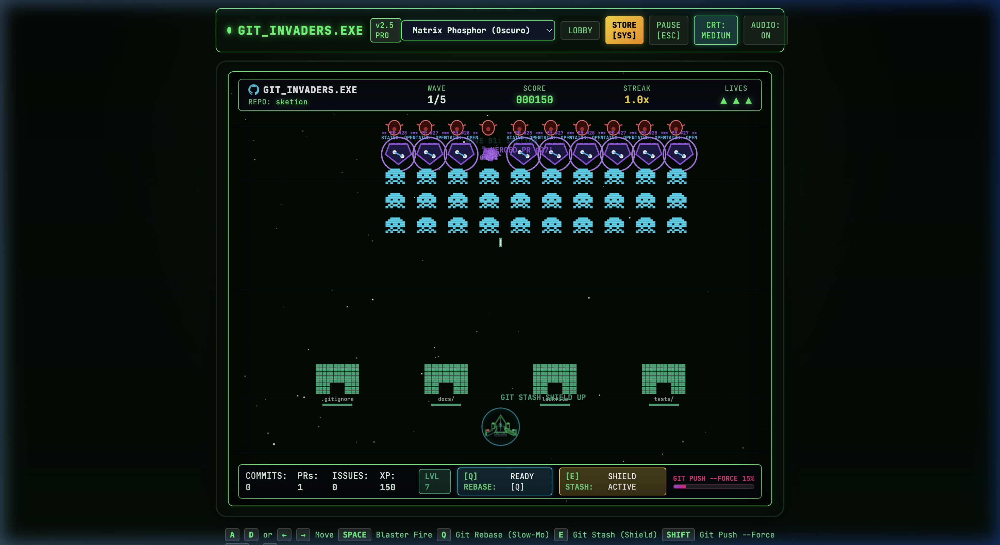
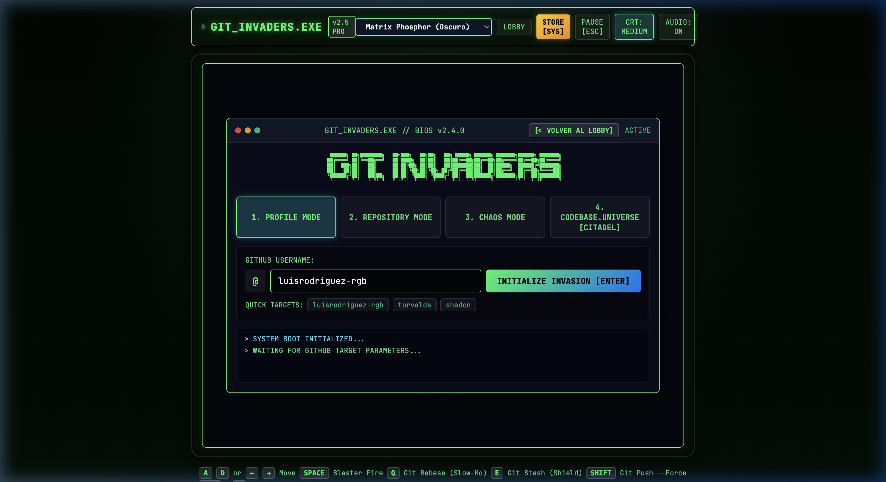
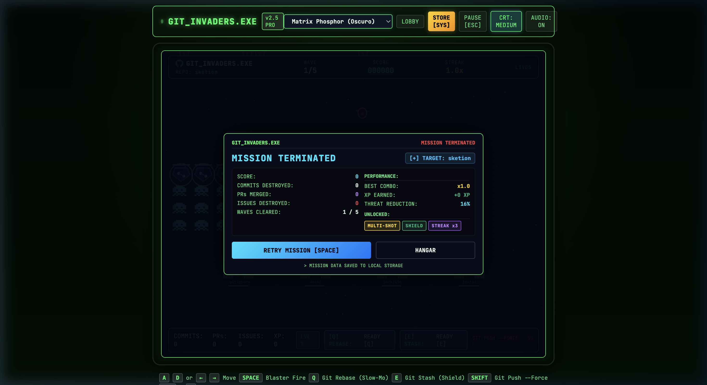
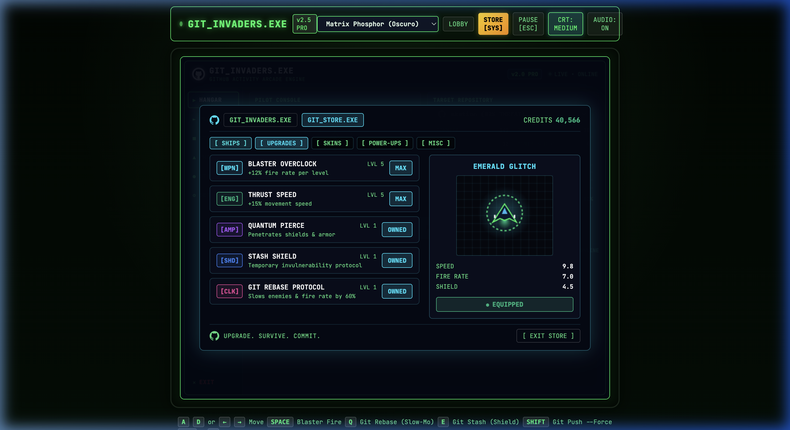

# GIT_INVADERS.EXE

```text
 ██████╗ ██╗████████╗   ██╗███╗   ██╗██╗   ██╗ █████╗ ██████╗ ███████╗██████╗ ███████╗
██╔════╝ ██║╚══██╔══╝   ██║████╗  ██║██║   ██║██╔══██╗██╔══██╗██╔════╝██╔══██╗██╔════╝
██║  ███╗██║   ██║      ██║██╔██╗ ██║██║   ██║███████║██║  ██║█████╗  ██████╔╝███████╗
██║   ██║██║   ██║      ██║██║╚██╗██║╚██╗ ██╔╝██╔══██║██║  ██║██╔══╝  ██╔══██╗╚════██║
╚██████╔╝██║   ██║██╗   ██║██║ ╚████║ ╚████╔╝ ██║  ██║██████╔╝███████╗██║  ██║███████║
 ╚═════╝ ╚═╝   ╚═╝╚═╝   ╚═╝╚═╝  ╚═══╝  ╚═══╝  ╚═╝  ╚═╝╚═════╝ ╚══════╝╚═╝  ╚═╝╚══════╝
```

> **`GIT_INVADERS.EXE`** es un arcade retro-futurista procedural construido con **TypeScript, Canvas 2D, SVG y Web Audio API**. El motor analiza actividad real de GitHub y la transforma mediante un sistema de **Repository DNA** en naves, enemigos, formaciones, comportamientos, oleadas y Code Bosses generados dinámicamente. Su arquitectura desacopla la composicion visual de las mecanicas mediante **estrategias de movimiento, maquinas de estados, sistemas de particulas y generacion procedural**, convirtiendo cada repositorio en un desafio visual, matematico y tactico diferente.

---

## Galeria Visual de la Suite Arcade

### Panel 1: Hangar, Telemetria de Repository DNA y Selector de Modo


### Panel 2: Arena de Combate, Tactical HUD y Matriz Deflectora de Boss


### Panel 4: Terminal BIOS, Logs de Eventos Git en Tiempo Real


### Panel 5: Mision Terminada, Debriefing de Combate y Progresion


### Panel 6: Arsenal Cibernetico, Overclocks de Firmware y Hangares de Naves


---

## Stack Tecnologico Oficial

```text
GIT_INVADERS.EXE
│
├── TypeScript
│   └── logica, entidades, sistemas, estados, datos
│
├── Canvas 2D
│   └── gameplay, naves, enemigos, particulas, proyectiles
│
├── SVG / Path2D
│   └── disenos vectoriales de naves, iconos, HUD
│
├── CSS
│   └── CRT, overlays, terminal, menus, efectos de interfaz
│
├── Web Audio API
│   └── musica y efectos procedurales
│
├── GitHub REST API
│   └── datos reales de repositorios y perfiles
│
└── Vite
    └── build, modulos y desarrollo
```

---

## Arquitectura del Motor (Pipeline Procedural)

```text
GitHub Data
     ↓
Repository DNA
     ↓
Procedural Generation
     ├── Ships (ShipDNA -> ShipComposer)
     ├── Enemies (Commits, Armored PRs, Issue Bugs)
     ├── Waves (Formations & Tech Stack Modifiers)
     └── Bosses (BossDNA -> BossGenerator)
     ↓
Real-Time Game Engine
     ├── AI Strategies (MovementStrategies)
     ├── State Machines (BossStateMachine)
     ├── Collision & Damage
     ├── Semantic Particles
     └── Web Audio API
     ↓
Canvas 2D + SVG Vector Pipeline
```

---

## Modulacion de Gameplay por Stack Tecnologico (Language Modifiers)

El motor evalua la composicion de lenguajes del repositorio analizado y altera la fisica y mecanica del combate en tiempo real:

| Stack / Lenguaje | Modificador de Gameplay | Efecto en Batalla |
| :--- | :--- | :--- |
| **JavaScript / TypeScript** | `Speed Boost (+15%)` | Mayor cadencia de proyectiles y velocidad de reactores |
| **Python** | `Support Drone Escort` | Spawnea drones autonomos de apoyo que escoltan la formacion |
| **C++ / Rust** | `Armor & Kinetic Deflectors` | Hulls reforzados, +1 capa de blindaje en naves y jefes |
| **HTML / CSS** | `Defensive Bunker Fortification` | +30% de resistencia e integridad en búnkeres defensivos |

---

## Sistema de Naves: Ship DNA y Arquetipos Vectoriales

El subsistema `ShipComposer` desacopla la geometria fisica de la nave en 8 capas vectoriales renderizadas a 60 FPS sin imagenes rasterizadas:
1. **Engines Flares:** Gradiente radial con fulgor dinamico y toberas mecanicas.
2. **Wings & Stabilizers:** Geometria alar con franjas de telemetria y cañones alares.
3. **Armored Hull Plating:** Casco central con nervadura dorsal y biseles.
4. **Weapon Hardpoints:** Puntos duros de anclaje de armamento con conductos de energia.
5. **Cockpit Visor:** Cupula poligonal con pulso de reactor y brillo especular blanco.
6. **Navigation Strobe Lights:** Luces estroboscopicas de puerto (rojo) y estribor (verde).
7. **Structural Damage Layer:** Fisuras metalicas y micro-chispas activadas cuando HP < 60%.
8. **Kinetic Shield Bubble:** Campo de fuerza radial con efecto Fresnel y absorcion de impacto.

### Arquetipos de Naves en el Hangar
1. **CYBER FALCON / COMPILER DELTA:** Caza interceptor balanceado con doble tobera de plasma cian (`#00e5ff`) y alas en flecha moderada.
2. **PHANTOM VIOLET:** Nave de sigilo con envergadura extendida (1.15x), cañones dobles de antimateria magenta y toberas purpuras (`#c084fc`).
3. **SOLAR GOLD:** Acorazado pesado de tres toberas de reaccion ambar (`#fbbf24`), cinco paneles blindados y blasters gemelos reforzados.
4. **EMERALD GLITCH:** Interceptor experimental con alas de barrido agresivo (0.72), estabilizadores de flujo y reactor mint (`#10b981`).
5. **NEON OVERDRIVE:** Nave de asalto rapido con cuatro puntos duros de anclaje frontal y toberas hiperaceleradas neon (`#ff007f`).
6. **QUANTUM CITADEL:** Fortaleza orbital pesada con ocho paneles de composite titanio, alas de asedio (1.35x) y deflectores cineticos reforzados (`#6366f1`).
7. **CUSTOM PROCEDURAL SHIP (Repository DNA):** Cualquier repositorio ingresado en el buscador sintetiza una nave unica modulando `hullType`, `wingType`, `engineCount`, `weaponType`, `armor`, `speed` y `aggression`.

---

## Flota Enemiga y Entidades Especiales

1. **Commit Invader:** Sprite pixel-art tradicional de matriz 8x8 con extremidades animadas en dos cuadros (Frame A / Frame B), coloreado por estado y portando el SHA real del commit.
2. **Armored Pull Request (`ArmoredPR`):** Crucero pesado con tarjeta de telemetria holografica `<< PR #... >>`, indicador `STATUS: OPEN` o `STATUS: MERGED`, barra de escudos segmentada y halo de fuerza deflector.
3. **Issue Bug Bomber (`IssueBomber`):** Dron biologico/mecanico con alas oscilantes por funcion seno, nucleo rojo de advertencia critica y trayectoria de intercepcion descendente.
4. **Code Boss / Titan Core:** Titan colosal multicapa con craneo mecanico, tenazas articuladas flotantes, reactor de plasma pulsante, cañones pesados de salva y matriz deflector giratoria.
5. **Mystery Contributor Drone:** Nave orbital no tripulada con el glifo vectorial de GitHub Octocat, otorgando multiplicadores y recompensas al ser derribada.
6. **Bunkers de Codigo:** Modulos defensivos con degradacion estructural pixel a pixel.

---

## Biblioteca Vectorial SVG (`SvgAssets`)

El motor incluye primitivas vectoriales de precision cero dependencias para su proyeccion tanto en Canvas2D mediante `Path2D` como en el DOM:
- `OCTOCAT_PATH`: Silueta oficial del Octocat de GitHub para naves misteriosas e insignias.
- `GIT_PULL_REQUEST_PATH`: Glifo de bifurcacion y union de ramas PR.
- `GIT_COMMIT_PATH`: Nodo individual de historial con lineas de enlace.
- `GIT_BRANCH_PATH`: Ramificacion de desarrollo concurrente.
- `ISSUE_BUG_PATH`: Icono de insecto/alerta para proyectiles e invasores Bug.

---

## Formaciones y Estrategias de Movimiento

### Formaciones de Oleadas (`WaveGenerator`)
- `GRID`: Formacion clasica Space Invaders (10 columnas x 5 filas) para la primera oleada limpia.
- `V_CHEVRON / DELTA_WING`: Formacion piramidal con cruceros PR en los flancos y bugs en vanguardia.
- `DIAMOND`: Rombo concentrico con escolta pesada en el centro.
- `SWARM / CONSTELLATION`: Racimos orbitales dispersos con movimiento en bandada.
- `PINCER / FLANKING_HELIX`: Dos columnas blindadas en las bandas con avanzadas rapidas de bugs.

### Estrategias de IA (`MovementStrategies`)
- `FormationMovement`: Movimiento coordenado en rejilla con descenso al borde de pantalla.
- `ZigZagMovement`: Oscilacion lateral senoidal para unidades agiles.
- `DiveAttack`: Aceleracion en picada hacia las coordenadas exactas del jugador.
- `TrackingAttack`: Vector continuo de persecucion angular.
- `OrbitMovement`: Trayectoria circular concentrica para satelites y drones de escolta.
- `SwarmMovement`: Fluctuacion parametrica multi-fase.

---

## Maquina de Estados del Boss (`BossStateMachine`)

El combate contra el Code Boss responde de forma dinamica al comportamiento del jugador:
- `ENTER`: Incursion hiperespacial descendente hacia la cota de combate.
- `ATTACK`: Salvas calibradas segun el numero de contribuidores del repositorio.
- `ENRAGED`: Activado por tiempo o dano rapido (+40% cadencia de fuego).
- `PHASE_2`: Activado al quebrar el escudo o superar un combo de jugador > 5x con HP < 70%.
- `CRITICAL`: Brecha de contencion de nucleo (HP < 25%), cortinas densas de plasma y temblor CRT.
- `DESTROYED`: Secuencia de detonaciones encadenadas y dispersion de particulas de codigo `FATAL`, `ERROR`, `500`, `CORE`.

---

## Sistema de Particulas Semanticas

Las explosiones emiten tokens de desarrollo tipados segun el enemigo purgado:
- **Commits:** `commit`, `hash`, `#`, `git`, `0x7F`, `diff`, `HEAD`
- **Pull Requests:** `PR`, `merge`, `< >`, `{ }`, `branch`, `approve`, `rebase`
- **Issues:** `BUG`, `404`, `!`, `null`, `void`, `ERR`, `panic`
- **Bosses:** `FATAL`, `ERROR`, `500`, `CORE`, `BREACH`, `SEGFAULT`, `CRITICAL`

---

## Modos de Juego

1. **Profile Mode (`@usuario`):** Escanea la actividad publica de cualquier usuario (ej. `luisrodriguez-rgb`, `torvalds`, `shadcn`) y genera oleadas proporcionales a su historial.
2. **Repository Mode (`usuario/repositorio`):** Incursion directa en un repositorio especifico (ej. `luisrodriguez-rgb/sketion`, `facebook/react`), culminando en su `CODE BOSS` exclusivo.
3. **Chaos Mode (`INSTANT`):** Simulacion offline con parametros extremos: `9,999 COMMITS`, `482 PRs`, `731 ISSUES`, cadencia demencial y `CHAOS LEVEL: MAX`.
4. **Codebase Universe Mode (`CITADEL`):** Enlace con la arquitectura espacial 2.5D de CODEBASE.UNIVERSE.

---

## Tienda y Progresion (`GIT_STORE.EXE`)

Acumula XP y creditos en combate para desbloquear mejoras persistentes en `localStorage`:
- **Blaster Overclock (Lvl 1 - 5):** Reduce el tiempo de recarga del disparo principal (+12% por nivel).
- **Thrust Velocity (Lvl 1 - 5):** Aumenta la velocidad de maniobra de la nave (+15% por nivel).
- **Quantum Piercing Lasers:** Los blasters perforan el primer invasor impactando objetivos posteriores.
- **Stash Shield Reserves:** Despliega un escudo de emergencia activo al inicio de cada mision.
- **Git Rebase Protocol:** Desbloquea `[Q]` para ralentizar enemigos y proyectiles un 60% durante 4 segundos.

---

## Controles de Combate

| Tecla / Control | Accion |
| :--- | :--- |
| `A` / `D` o `←` / `→` | Mover la nave |
| `SPACE` | Disparar blaster principal (mantener para rafaga continua) |
| `Q` | Activar `GIT REBASE` (Slow-Motion 4s) |
| `E` | Activar `GIT STASH` (Escudo de emergencia) |
| `SHIFT` | Activar `GIT PUSH --FORCE` (Overdrive Wiping Beam) |
| `ESC` o `P` | Pausar / Reanudar el proceso |
| Controles Tactiles | Pad virtual integrado para dispositivos moviles |

---

## Instalacion y Ejecucion Local

Requiere **Node.js** y **pnpm**:

```bash
# 1. Clonar el repositorio
git clone https://github.com/luisrodriguez-rgb/GIT_INVADERS.EXE.git
cd GIT_INVADERS.EXE

# 2. Instalar dependencias
pnpm install

# 3. Iniciar servidor de desarrollo
pnpm dev

# 4. Construir bundle de produccion optimizado
pnpm build
```

---

## Licencia

MIT (c) 2026 Luis Felipe Rodriguez - Disenado como motor interactivo de datos y simulacion arcade procedural.
