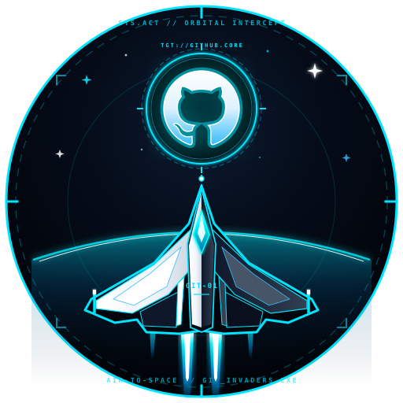
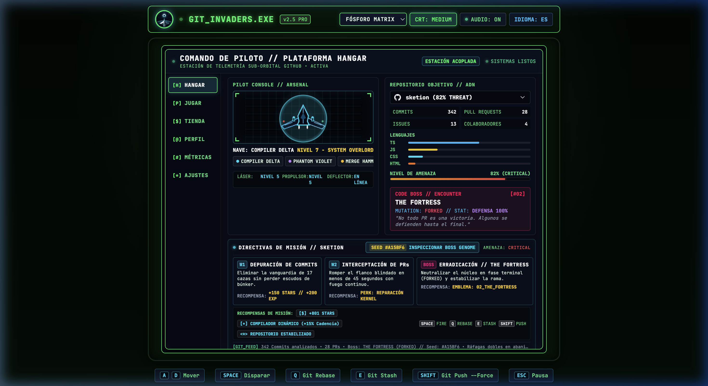

# GIT_INVADERS.EXE

<p align="center">
  
</p>

```text
 ██████╗ ██╗████████╗   ██╗███╗   ██╗██╗   ██╗ █████╗ ██████╗ ███████╗██████╗ ███████╗
██╔════╝ ██║╚══██╔══╝   ██║████╗  ██║██║   ██║██╔══██╗██╔══██╗██╔════╝██╔══██╗██╔════╝
██║  ███╗██║   ██║      ██║██╔██╗ ██║██║   ██║███████║██║  ██║█████╗  ██████╔╝███████╗
██║   ██║██║   ██║      ██║██║╚██╗██║╚██╗ ██╔╝██╔══██║██║  ██║██╔══╝  ██╔══██╗╚════██║
╚██████╔╝██║   ██║██╗   ██║██║ ╚████║ ╚████╔╝ ██║  ██║██████╔╝███████╗██║  ██║███████║
 ╚═════╝ ╚═╝   ╚═╝╚═╝   ╚═╝╚═╝  ╚═══╝  ╚═══╝  ╚═╝  ╚═╝╚═════╝ ╚══════╝╚═╝  ╚═╝╚══════╝
```

<p align="center">
  
  
  
  
  
  
  
</p>

> **`GIT_INVADERS.EXE`** es un arcade retro-futurista procedural de alta fidelidad construido íntegramente con **TypeScript, Canvas 2D, SVG Path2D y Web Audio API**. El motor analiza telemetría real de repositorios y perfiles de GitHub y la transforma, mediante un pipeline de **Repository DNA**, en naves de combate con 8 capas vectoriales, enemigos tipados, oleadas con formaciones tácticas, modificadores de combate por lenguaje y **10 arquetipos de Code Bosses generados proceduralmente** con mutaciones genéticas, semillas deterministas y síntesis de audio reactiva (**AudioDNA**).

---

## 📸 Galería Visual de la Suite Arcade

### Panel 1: Hangar Táctico, Flota de Naves, Dossier del Boss y Directivas en Vivo
*Vista panorámica 16:9 con selector para las 8 naves de la flota, previsualización vectorial en tiempo real, telemetría de ADN del repositorio y panel de directivas de misión.*


---

### Panel 2: Arena de Combate, Tactical HUD, Escudos de PR y Partículas Semánticas
*Combate activo a 60 FPS con proyectiles de plasma, escudos deflectores cinéticos, barreras de código degradables y partículas de depuración de memoria.*


---

### Panel 3: Inspector de Genoma del Boss (Boss Genome) y Matriz de Mutación
*Modal de telemetría forense con semilla determinista (ej. `#A15BF6`), radar de atributos pentagonales, mutaciones genéticas activas y análisis causal.*


---

### Panel 4: Terminal BIOS y Escáner de Repositorios en Tiempo Real
*Interfaz de línea de comandos retro CRT con logging en vivo de eventos Git, analizador de árboles de sintaxis y selector de temas cromáticos fósforo.*


---

### Panel 5: Misión Terminada, Debriefing de Rendimiento y Progresión
*Resumen de combate con cálculo de XP, recompensas de estrellas de GitHub, precisión balística, multiplicadores de combo y registro de artefactos recolectados.*


---

### Panel 6: Arsenal Cibernético y Tienda de Firmware (`GIT_STORE.EXE`)
*Tienda de mejoras permanentes en `localStorage` con catálogo de 8 naves, overclocks de cadencia, blindajes cuánticos y protocolos de rebase temporal.*


---

## 🎮 Modos de Juego

1. **Repository Incursion (`usuario/repositorio`):**
   - Escanea un repositorio específico de GitHub (ej. `facebook/react`, `luisrodriguez-rgb/GIT_INVADERS.EXE`, `torvalds/linux`).
   - Extrae métricas reales (commits, PRs, issues, colaboradores, lenguajes) y genera una campaña procedural de 3 oleadas culminando en su **Code Boss** exclusivo.

2. **Profile Assault (`@usuario`):**
   - Escanea el perfil público de un desarrollador en GitHub.
   - Modula el volumen de la flota enemiga y la dificultad en función del historial público de contribuciones y commits acumulados.

3. **Instant Chaos Mode (`CHAOS // MAX`):**
   - Simulación offline de máxima intensidad calibrada a 9,999 commits, 482 PRs y 731 issues.
   - Despliega oleadas de nivel de amenaza extremo con cadencia de disparo multiplicada e invasores enfurecidos.

4. **Codebase Universe Mode (`CITADEL`):**
   - Enlace directo con la infraestructura espacial interactiva 2.5D del universo de repositorios.

---

## 🧬 Pipeline Causal de Generación Procedural

El motor implementa un pipeline causal y determinista donde **ningún elemento visual o matemático es aleatorio**. Cada atributo del combate proviene directamente de los datos del repositorio analizado:

```text
                        ┌───────────────────────────────┐
                        │   GitHub REST API / Metrics   │
                        │ (Commits, PRs, Issues, Con.)  │
                        └───────────────┬───────────────┘
                                        ▼
                        ┌───────────────────────────────┐
                        │        Repository DNA         │
                        │ (Fingerprint & Threat Index)  │
                        └───────┬───────────────┬───────┘
                                │               │
                ┌───────────────┘               └───────────────┐
                ▼                                               ▼
┌───────────────────────────────┐               ┌───────────────────────────────┐
│     Ship Vector Synthesis     │               │     Boss Genome Synthesis     │
│ (8-Layer Procedural Geometry) │               │   (10 Archetypes + Mutations) │
└───────────────┬───────────────┘               └───────────────┬───────────────┘
                │                                               │
                │        ┌──────────────────────────────┐       │
                ├───────►│  Real-Time Game Engine       │◄──────┤
                │        │  - AI Movement Strategies    │       │
                │        │  - 4-Phase Boss StateMachine │       │
                │        │  - Collision & Hitboxes      │       │
                │        │  - Semantic Particles        │       │
                │        │  - Dynamic AudioDNA (Synth)  │       │
                │        └──────────────┬───────────────┘       │
                │                       ▼                       │
                └────────► Canvas 2D + SVG Path2D ◄─────────────┘
                                 (60 FPS)
```

---

## 🚀 Flota de Naves de Combate (8 Arquetipos Vectoriales)

El subsistema `ShipComposer` desacopla la geometría física de la nave en 8 capas vectoriales generadas dinámicamente mediante funciones trigonométricas y matemáticas de curvas de Bézier:
1. **Engine Flares:** Gradiente radial con toberas mecánicas y fulgor reactivo.
2. **Wings & Stabilizers:** Geometría alar con franjas de telemetría y cañones alares.
3. **Armored Hull Plating:** Casco central con nervaduras dorsales y biseles metálicos.
4. **Weapon Hardpoints:** Puntos duros de anclaje balístico con conductos de energía.
5. **Cockpit Visor:** Cúpula poligonal con pulso de reactor y brillo especular.
6. **Navigation Strobe Lights:** Luces estroboscópicas de babor (rojo) y estribor (verde).
7. **Structural Damage Layer:** Fisuras metalúrgicas y chispas cuando `HP < 60%`.
8. **Kinetic Shield Bubble:** Campo de fuerza radial con efecto Fresnel y absorción de impactos.

### 📋 Especificaciones Técnicas de la Flota (10 Naves Exclusivas)

| Nave | Geometría Física | Paleta Multi-Tono (Hull / Acento / Blindaje) | Blindaje | Velocidad | Cadencia | Escudo | Habilidad Táctica | Mecánica en Batalla |
| :--- | :--- | :--- | :---: | :---: | :---: | :---: | :--- | :--- |
| **CYBER FALCON** | `delta_interceptor` | `#00e5ff` Cian / `#38bdf8` Azul Hielo / `#0e263d` Marino | 60% | 70% | 60% | 50% | `COMPILER BURST` (`SPACE`) | Ráfaga triple de proyectiles de plasma cian de alta precisión. |
| **PHANTOM VIOLET** | `forward_swept` | `#a855f7` Neón Púrpura / `#00f5ff` Menta / `#1d0c33` Amatista | 40% | 100% | 70% | 30% | `GIT STASH` (`E`) | Desfase de intangibilidad temporal e inmunidad total durante 3.5s. |
| **SOLAR GOLD** | `hammerhead_ram` | `#f59e0b` Oro / `#fbbf24` Latón / `#ef4444` Rojo Furia | 100% | 30% | 40% | 80% | `MERGE BURST` (`E`) | Absorbe impactos frontales y desata una onda de choque cinética expansiva. |
| **EMERALD GLITCH** | `fractal_asymmetric` | `#10b981` Esmeralda / `#facc15` Amarillo / `#0a291a` Tóxico | 50% | 80% | 60% | 50% | `BRANCH SPLIT` (`E`) | Despliega 2 drones tácticos que replican el fuego de armas durante 5s. |
| **NEON OVERDRIVE** | `ramjet_dragster` | `#ff0055` Carmesí / `#ff7700` Naranja / `#ffea00` Cyber | 40% | 90% | 90% | 20% | `GIT REBASE` (`Q`) | Aceleración hipercinética con embate frontal penetrante e invulnerabilidad. |
| **QUANTUM WING** | `quantum_trimaran` | `#06b6d4` Turquesa / `#6366f1` Índigo / `#e0e7ff` Blanco | 50% | 70% | 60% | 60% | `QUANTUM PIERCE` (`SPACE`) | Dispara rayos de plasma continuo con perforación balística multiobjetivo. |
| **QUANTUM CITADEL** | `toroidal_ring` | `#3b82f6` Azul Real / `#f8fafc` Platino / `#f59e0b` Dorado | 70% | 60% | 70% | 90% | `OCTO PROTOCOL` (`E`) | Genera un enjambre de 8 micro-drones defensivos que interceptan disparos. |
| **CODEBREAKER // X** | `x_dreadnought` | `#ec4899` Hot Pink / `#10b981` Cyber Lime / `#7c3aed` Violeta | 100% | 50% | 100% | 90% | `GIT PUSH --FORCE` (`SHIFT`) | Desata un superláser colosal que barre la totalidad de la pantalla. |
| **VOID STALKER** | `stealth_dagger` | `#ef4444` Carmesí Sangre / `#f59e0b` Oro Prisma / `#090a10` Obsidiana | 40% | 95% | 80% | 40% | `TEMPORAL RIFT` (`E`) | Ralentiza proyectiles enemigos un 80% y teletransporta la nave al flanco opuesto. |
| **SOLAR PHOENIX** | `phoenix_swept` | `#ea580c` Naranja Fénix / `#facc15` Amarillo Solar / `#06b6d4` Cian Ion | 60% | 85% | 85% | 70% | `SUPERNOVA NOVA` (`SPACE`) | Descarga un estallido omnidireccional de plasma que calcina proyectiles e invasores. |

---

## 👾 Los 10 Arquetipos de Code Bosses

Cada repositorio se clasifica matemáticamente en uno de los **10 arquetipos de Code Bosses**, con atributos de combate, ataques únicos, cotas de blindaje y fases terminales personalizadas:

| N° | Arquetipo | Concepto de Repositorio | Stat Especial | Ataque Principal | Ataque Secundario | Fase Terminal |
| :-: | :--- | :--- | :---: | :--- | :--- | :--- |
| **01** | **THE COMMIT CORE** | Alta frecuencia de commits y CI/CD continuo. | `SPAWN: 90%` | Lluvia de Commits | Drones de Historial | `HISTORY OVERFLOW` |
| **02** | **THE FORTRESS** | Alto volumen de Pull Requests y code reviews. | `DEFENSA: 100%` | Escudo Deflector | Torretas de PRs | `MERGE LOCK` |
| **03** | **THE ISSUE SWARM** | Rastreador con alta densidad de bugs y reportes. | `ENJAMBRE: 100%` | Bombas de Bugs | Ráfagas Erráticas | `CRITICAL BUG` |
| **04** | **THE DEPENDENCY HYDRA** | Árbol modular con dependencias interconectadas. | `COMPLEJIDAD: 100%` | Cadena Energética | Fragmentación de Nodos | `DEPENDENCY HELL` |
| **05** | **THE MERGE CONFLICT** | Ramas bifurcadas en conflicto `<<<<<<< HEAD`. | `CONFLICTO: 100%` | División de Ramas | Láser Cruzado en X | `UNRESOLVED` |
| **06** | **THE CONTRIBUTOR OVERLORD** | Ecosistema colaborativo con gran flota de autores. | `FLOTA: 100%` | Drones de Soporte | Sifón de Experiencia | `OPEN SOURCE ARMY` |
| **07** | **THE BRANCHLORD** | Múltiples ramas vivas y universos de features. | `RAMIFICACIÓN: 100%` | Disparos Split | Decoys Holográficos | `BRANCH COLLAPSE` |
| **08** | **THE REBASE PHANTOM** | Código legado reescrito con firma de sigilo. | `SIGILO: 100%` | Dash Cuántico | Rewind de Daño | `FORCE REBASE` |
| **09** | **THE SECURITY SENTINEL** | Arquitectura enterprise y políticas zero-trust. | `SEGURIDAD: 100%` | Barrera Firewall | Encriptación Aegis | `BREACH DETECTED` |
| **10** | **THE CODE ABYSS** | Monolito cósmico con complejidad gravitacional. | `SINGULARIDAD: 100%` | Colapso Gravitacional | Distorsión de Física | `SYSTEM LIMIT` |

---

## 🧪 Stack de Mutaciones Genéticas (Genetic Mutations)

El motor evalúa el nivel de amenaza (`threatLevel`) y aplica una **mutación primaria** y una **mutación secundaria** con sinergias de combate:

- **`OVERCLOCKED`:** +35% velocidad balística, +40% cadencia de fuego sostenido y drones en ráfaga rápida. Tempo de audio a 148 BPM.
- **`RECURSIVE`:** Los proyectiles emiten réplicas retardadas en cascada a 0.8s; submódulos que imitan las coordenadas del jugador.
- **`CORRUPTED`:** Trayectorias sinusoidales caóticas, minas de error y sintetizador bitcrush desafinado a -140 cents.
- **`DISTRIBUTED`:** Nodos satélite interconectados con red de daño compartido y fuego divergente.
- **`SECURED`:** Placas deflectoras rotatorias y pulso electromagnético EMP si el jugador activa sus escudos.
- **`LEGACY`:** Proyectiles cinéticos pesados con teleport de *History Rewind* que restaura blindaje perdido.
- **`FORKED`:** Chasis bifurcado simétrico con salvas dobles en abanico cruzado.
- **`UNSTABLE`:** Arcos de plasma radiante y ondas de choque de daño en área crítica.

---

## 🎵 Motor de Síntesis Reactiva AudioDNA

El audio en `GIT_INVADERS.EXE` se sintetiza en tiempo real utilizando la **Web Audio API** nativa de navegador (cero archivos `.mp3`/`.wav` externos):
- **BPM Adaptativo:** Modulado entre 96 BPM (código legado) y 148 BPM (proyectos overclockeados).
- **Escalas Armónicas Dinámicas:** Conmutación entre *D Minor Cyberpunk* (armónica menor) y *Locrian Glitch* (locria alterada con notas tritonales).
- **Efectos en Tiempo Real:** Nodos biquad filter, moduladores de onda sinusoidal/cuadrada/sierra, reverberación convolutiva y puertas de ruido adaptativas.

---

## ⚡ Modificadores de Combate por Lenguaje (Language Modifiers)

La composición porcentual de lenguajes del repositorio altera la física y mecánica del combate:

| Lenguaje / Ecosistema | Modificador Táctico | Efecto en Batalla |
| :--- | :--- | :--- |
| **TypeScript / JavaScript** | `Dynamic Compiler (+15% Fire Rate)` | Mayor cadencia de disparo y proyectiles de alta frecuencia. |
| **Python** | `Subprocess Drone Escort` | Spawnea drones de soporte orbital que asisten a la nave. |
| **Rust / C++** | `Zero-Cost Deflector Armor` | +25% de resistencia de casco y deflectores cinéticos reforzados. |
| **HTML / CSS** | `Defensive Bunker Hardening` | +30% de integridad estructural en búnkeres de contención. |
| **Go** | `Concurrent Goroutine Swarm` | Invocación de micro-nodos de ataque concurrente coordinado. |
| **Java / C#** | `Enterprise Object Shield` | Capa adicional de blindaje polimórfico contra daño por plasma. |

---

## 🕹️ Controles de Combate

| Tecla / Control | Acción |
| :--- | :--- |
| `A` / `D` o `←` / `→` | Mover la nave lateralmente |
| `SPACE` | Disparar blaster principal (mantener presionado para ráfaga continua) |
| `Q` | Activar **`GIT REBASE`** (Ralentización temporal / Dash cinético) |
| `E` | Activar **`GIT STASH` / `BRANCH SPLIT`** (Intangibilidad / Despliegue de drones) |
| `SHIFT` | Activar **`GIT PUSH --FORCE`** (Superláser de aniquilación global) |
| `ESC` o `P` | Pausar / Reanudar la simulación |
| **Touch Controls** | Controles táctiles virtuales optimizados para pantallas táctiles y móviles |

---

## 🛠️ Stack Tecnológico

```text
GIT_INVADERS.EXE
├── Core Logic: TypeScript 5.x (Strict Typing, State Machines, Procedural Math)
├── Rendering: Canvas 2D Engine + SVG Path2D Vectors (Zero External Images)
├── Audio: Web Audio API (Multi-Oscillator Subtractive Synthesis & AudioDNA)
├── Styling & CRT: Vanilla CSS (Scanlines, Phosphor Glow, Aberration Shaders)
├── Data Integration: GitHub REST API v3 (Octokit Octocat Pipeline)
└── Bundler: Vite 5.x (HMR, Tree Shaking, ESM Optimized Builds)
```

---

## 📦 Instalación y Ejecución Local

### Prerrequisitos
- **Node.js** (v18.0 o superior)
- **pnpm** (o `npm` / `yarn`)

### Pasos de Instalación
```bash
# 1. Clonar el repositorio oficial
git clone https://github.com/luisrodriguez-rgb/GIT_INVADERS.EXE.git
cd GIT_INVADERS.EXE

# 2. Instalar dependencias
pnpm install

# 3. Iniciar servidor de desarrollo local
pnpm dev

# 4. Compilar bundle de producción optimizado
pnpm build
```

---

## 👨‍💻 Autor y Licencia

Desarrollado y mantenido por **Luis Rodriguez** ([@luisrodriguez-rgb](https://github.com/luisrodriguez-rgb)).

<div align="center">
  <a href="https://github.com/luisrodriguez-rgb">
    
    <br/>
    <strong>Luis Rodriguez (luisrodriguez-rgb)</strong>
  </a>
</div>

<br/>

Distribuido bajo la Licencia **MIT**. Consulta el archivo `LICENSE` para más detalles.
